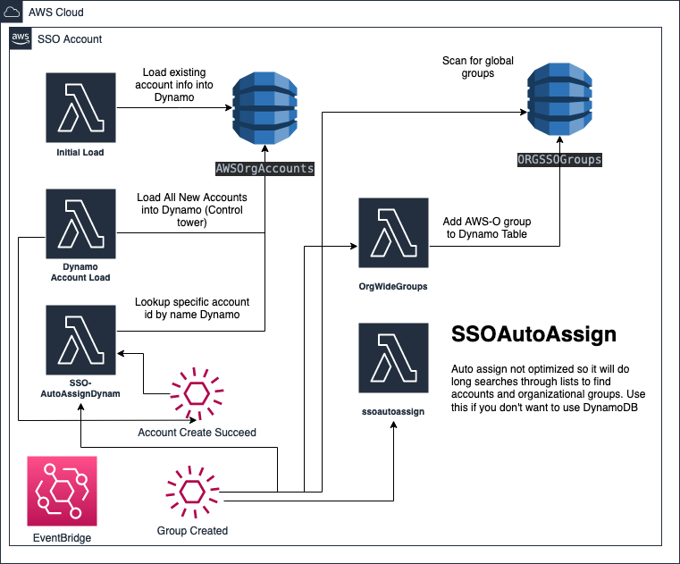

# SSOAutoAssign

This project is used to automate AWS SSO assignment based on group name
- Account Specific Personas AWS-A-Develop-Developer (Gives access to Develop for single account on Developer permission set)
- Organization specific persona AWS-O-Admin (Gives access to entire org for group on Admin permission set)
- Initial Load will load all of your account information into dynamo db (I did this because AWS API does not support filter on account)
- This system on initial deploy uses dynamo db method. If you don't want to use that please comment out SSOAutoAssignDynamo and uncomment SSOAutoAssign resource
- Does not support more than 100 groups or accounts. That should be in V2.
## ORG wide groups
This is literally because AWS does not support start with for group search. So we create a dynamo db table and store the O groups.
Much more scalable vs adding to list and sorting (You try this with 1000s of groups).

## Unit Tests

The tests in the folder are the default for SAM. If someone wants to add tests please do. 

## Please feel free to fork this and set up pattern based on your naming convention I found AWS-A and AWS-O work best. 

## Architecture


This is a sam app, so it's pretty simple to deploy. If it's your first time deploying run the following it pretty much guides you through deployment (Hence guided)

```bash 
sam deploy --guided
```

You can also set this up in multiple environments' dev vs prod which could and probably does have different sso arn and directory id
EX: 
```bash 
sam deploy --config-env dev
```

```
sam deploy --config-env prod
```
